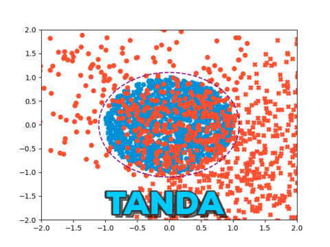

# Learning to Compose Domain-Specific Transformations for Data Augmentation
### *Or: Transformation Adversarial Networks for Data Augmentations (TANDA)*

#### Corresponding authors: [Alex Ratner](https://ajratner.github.io) (ajratner@cs.stanford.edu), [Henry Ehrenberg](https://github.com/henryre) (henryre@cs.stanford.edu)

#### [TANDA blog post](https://hazyresearch.github.io/snorkel/blog/tanda.html)

#### Paper (NeurIPS 2017): [Learning to Compose Domain-Specific Transformations for Data Augmentation](https://arxiv.org/abs/1709.01643) 

#### Hazy Research: [GitHub](https://github.com/HazyResearch), [research homepage](http://snorkel.stanford.edu)

## NEW: an easy-to-use Keras interface

Just in time for NeurIPS 2017, we're releasing an **easy-to-use substitute for Keras'
[`ImageDataGenerator`](https://keras.io/preprocessing/image/) data augmentation
class. Just swap in [`TANDAImageDataGenerator`](keras/tanda_keras.py) and you'll
be using our trained data augmentation models!** For a recipe on how to use it,
check out [`keras/keras_cifar10_example.py`](keras/keras_cifar10_example.py).
All we did was copy
Keras' [CIFAR-10 CNN example script](https://github.com/fchollet/keras/blob/master/examples/cifar10_cnn.py)
and plug in the `TANDAImageDataGenerator`. Easy as that.

## Overview

Using data augmentation on benchmark machine learning tasks, like MNIST and
CIFAR-10, yields large performance gains.
But using data augmentation on new tasks can prove difficult.
We've found that while it's usually easy for practitioners to

* obtain large quantities of labeled data; and
* come up with individual label-preserving data transformations (e.g. small image rotations),

constructing and tuning the more sophisticated compositions typically needed to
achieve state-of-the-art results is a time-consuming manual task.
The TANDA library unlabeled data points and arbitrary, user-provided
transformation functions as input, and learns how to compose them to generate
*realistic*, augmented data points.

### Visual examples

#### Synthetic data

The original data points (blue) are distributed at random within the purple
dotted line. We define several random displacement vectors as transformations,
and the orange points are augmented copies of blue data points.
At first, the transformations are applied effectively at random, yielding many
augmented points outside of the true data distribution.
After a few iterations, the augmentation model learns how to create sequences
of displacements that yield augmented data points within the distribution of
interest.



#### MNIST

We learned an augmentation model for the MNIST data set using rotation, shear,
elastic deformation, and rescaling transformation functions.
The figure shows 100 augmented MNIST images.
While they initially do not look like realistic digits, the model learns to 
compose the image transformations to generate realistic augmented images.


## Installation

First, clone this repo. TANDA is compatable with both Python 2.7 and Python 3.5+
and requires [a few packages](python-package-requirement.txt) (see note below) which
can be installed using `pip` (or [`conda`](https://www.continuum.io/downloads)).

```bash
pip install --requirement python-package-requirement.txt
```

If you're using the Keras interface, you'll need to install Keras as well.

*Note: currently, TANDA only works with TensorFlow 1.2. This is enforced in
`python-package-requirement.txt`. We do not recommend using newer versions
right now, as models will not train correctly.*

## Example usage

TANDA includes example TAN training scripts for MNIST and CIFAR-10. You'll need
to add the TANDA library to your path first. From the top-level `tanda`
directory, just run

```bash
source set_env.sh
```

The example scripts can be found in `example-scripts`. To train an MNIST TAN:

```bash
example-scripts/mnist-example.sh
```

Before running experiments with CIFAR-10, you'll need to download the data:

```bash
cd experiments/cifar10
./download-data.sh
cd $TANDAHOME
```

Then to train a CIFAR-10 TAN, run:

```bash
example-scripts/cifar-example.sh
```

## Running experiments with custom parameters

### Single experiment
To run a single experiment, for example on CIFAR-10:
```bash
source set_env.sh
python experiments/cifar10/train.py --run_name test_run [FLAGS]
```

The vast majority of flags can be found in `experiments/train_scripts.py`, but
individual train scripts (e.g. `experiments/cifar10/train.py`) may also have
custom flags.

The `run_type` flag determines the mode to run in:
* `tanda-full` [default]: Train a TAN, then use this to train a data-augmented end model
* `tan-only`: Train TAN only
* `tanda-pretrained`: Load trained TAN, then use this to train a data-augmented end model
* `random`: Train a randomly-augmented end model
* `baseline`: Train an end model with no data augmentation

TensorBoard visualizations are available during (and after) training:

```bash
tensorboard --logdir experiments/log/[DATESTAMP]/[RUN_NAME]_[TIMESTAMP]
```

### Multiple experiments
To launch a set of experiments in parallel, first define a config file (see `experiments/cifar10/config/` for examples), then run e.g.:
```bash
source set_env.sh
python experiments/launch_run.py --script experiments/cifar10/train.py --config experiments/cifar10/config/tan_search_config.json
```

To see quick stats from the TAN training, run:
```bash
python experiments/print_tan_stats.py --log_root [LOG_ROOT]
```

One procedure is to train a set of TAN models (setting `tan_only=True`), then
choose the best ones (by e.g. visual appearance or generative-to-random
loss ratio), then run these with end models.  This can be done in parallel:
```bash
python experiments/launch_end_models.py --script experiments/cifar10/train.py --end_model_config experiments/cifar10/config/end_model_config.json --tan_log_root [LOG_ROOT] --model_indexes 1 5 7
```
